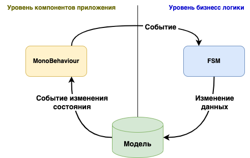

Как использовать AxGridUnityTools
=================================

AxGridUnityTools дает возможность использовать не прямой способ взаимодействия объектов, тем самым отделить логику от компонентов.
Такой подход часто используется в WEB программировании (MVC, MVVM).



Такой подход обеспечит хорошее переиспользование компонентов и логики.

Хороший пример будет создание простого компонента для упроавления текстом `UnityEngine.UI.Text`.

```csharp
[RequireComponent(typeof(UnityEngine.UI.Text))]
public class TextBinder : MonoBehaviourExtBind
{
    private UnityEngine.UI.Text Text;
    
    [SerializeField]
    private string _fieldName;

    [OnAwake]
    public void Init()
    {
        this.Text = this.GetComponent<UnityEngine.UI.Text>();
    }

    [Bind("On{_fieldName}Changed")]
    public void OnValueChanged(string value)
    {
        this.Text.text = value;
    }    
}
```

Такой компонент можно исполльзовать на любом необъодимом объекте, и он будет слушать все изменения поля, заданного в _fieldName, в Модели.

А теперь создадим модификатор для этого компонента, например кнопку.

```csharp
[RequireComponent(typeof(UnityEngine.UI.Button))]
public class ButtonInvoker : MonoBehaviourExt
{
    private UnityEngine.UI.Button Button;
    
    [SerializeField]
    private string _fieldName;

    [OnAwake]
    public void Init()
    {
        this.Button = this.GetComponent<UnityEngine.UI.Button>();
        this.Button.onClick.AddListener(this.OnClick);
    }
    
    private void OnClick()
    {
        Model.Set(_fieldName, Model.GetString(_fieldName, "") + " Hello");
    }
}
```

Вы можете создать сколько угодно кнопок и любое количество полей, подписать их на одно и то-же поле и все они будут отрабатывать одинаково.
Самый важный момент такого подхода в том, что если у вас не будет компонента `TextBinder`, то все кнопки будут работать, но ничего не изменят.
